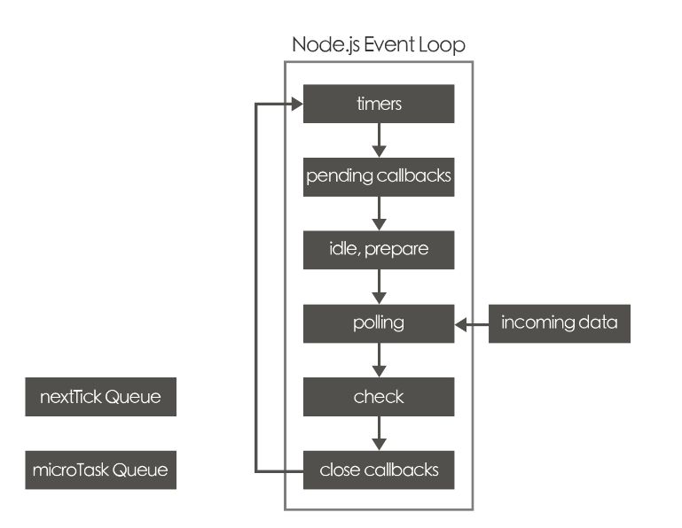

# Event Loop


### JS为什么是单线程的?

最初设计JS是用来在浏览器验证表单操控DOM元素的是一门脚本语言，如果js是多线程的那么两个线程同时对一个DOM元素进行了相互冲突的操作，那么浏览器的解析器是无法执行的。

### JS为什么需要异步?

如果JS中不存在异步，只能自上而下执行，如果上一行解析时间很长，那么下面的代码就会被阻塞。对于用户而言，阻塞就意味着"卡死"，这样就导致了很差的用户体验。比如在进行ajax请求的时候如果没有返回数据后面的代码就没办法执行。

写这篇文章之前我一直以为事件循环简单的很，就是先执行同步操作，然后把异步操作排在事件队列里，等同步操作都运行完了（运行栈空闲），按顺序运行事件队列里的内容。


Node.js的輕巧高效來自於他只使用單執行緒與Event Loop(事件迴圈)的概念.任何需要等待結果的、請求外部資源才能進行的函式，一律丟到Event Loop中等待。


引出来很多其他概念，比如event table和event queue，我们来看运行过程：

1. 首先判断JS是同步还是异步，同步就进入主线程运行，异步就进入event table。
2. 异步任务在event table中注册事件，当满足触发条件后（触发条件可能是延时也可能是ajax回调），被推入event queue。
3. 同步任务进入主线程后一直执行，直到主线程空闲时，才会去event queue中查看是否有可执行的异步任务，如果有就推入主线程中。


```javascript
setTimeout(() => {
  console.log('2 second')
}, 2000)
```


我们分析一下这段代码，setTimeout是异步操作。首先进入event table，注册的事件就是他的回调，触发条件就是2秒之后，当满足条件回调被推入event queue，当主线程空闲时会去event queue里查看是否有可执行的任务。


当这段代码在 Node.js 环境下执行时，事件循环（Event Loop）会按照以下步骤工作：

1. Node.js 解析该段代码，并将其加入到执行栈（Call Stack）中。
2. 遇到 `setTimeout` 函数时，Node.js 会将其推送到定时器（Timer）模块中，该模块将在 2 秒后将回调函数添加到事件队列（Event Queue）中。
3. 执行栈（Call Stack）中的代码已经全部执行完毕，此时 Node.js 会检查事件队列（Event Queue）中是否有任务。由于 `setTimeout` 中的回调函数还没有到达执行时间，因此事件队列（Event Queue）为空。
4. 在经过 2 秒后，Timer 模块会将回调函数添加到事件队列（Event Queue）中。
5. 此时，事件循环（Event Loop）会检查事件队列（Event Queue）中是否有任务。由于存在一个回调函数，因此事件循环（Event Loop）将该函数推送到执行栈（Call Stack）中执行。
6. 执行栈（Call Stack）中的代码输出 '2 second'，然后被移出栈（Call Stack）。
7. 事件循环（Event Loop）继续检查事件队列（Event Queue）中是否有任务。

因此，该段代码的输出结果是：'2 second'。在运行 `setTimeout` 函数时，回调函数并不是立即执行的，而是在 2 秒后才会被添加到事件队列（Event Queue）中。在事件循环（Event Loop）检测到事件队列（Event Queue）中存在回调函数后，才会将其推送到执行栈（Call Stack）中执行。


```
console.log(1) // 同步任务进入主线程
setTimeout(fun(),0)   // 异步任务，被放入event table， 0秒之后被推入event queue里
console.log(3) // 同步任务进入主线程
```


1、3是同步任务马上会被执行，执行完成之后主线程空闲去event queue(事件队列)里查看是否有任务在等待执行，这就是为什么setTimeout的延迟时间是0毫秒却在最后执行的原因


setTimeout有一点要注意延时的时间有时候并不是那么准确。


```
setTimeout(() => {
  console.log('2 second')
}, 2000)
sleep(9999999999)
```

分析运行过程：

1. console进入Event Table并注册，计时开始。
2. 执行sleep函数，sleep方法虽然是同步任务但sleep方法进行了大量的逻辑运算，耗时超过了2秒。
3. 2秒到了，计时事件timeout完成，console进入Event Queue，但是sleep还没执行完，主线程还被占用，只能等着。
4. sleep终于执行完了，console终于从Event Queue进入了主线程执行，这个时候已经远远超过了2秒。

其实延迟2秒只是表示2秒后，setTimeout里的函数被会推入event queue，而event queue(事件队列)里的任务，只有在主线程空闲时才会执行。上述的流程走完，我们知道setTimeout这个函数，是经过指定时间后，把要执行的任务(本例中为console)加入到Event Queue中，又因为是单线程任务要一个一个执行，如果前面的任务需要的时间太久，那么只能等着，导致真正的延迟时间远远大于2秒。 


我们还经常遇到setTimeout(fn，0)这样的代码，它的含义是，指定某个任务在主线程最早的空闲时间执行，意思就是不用再等多少秒了，只要主线程执行栈内的同步任务全部执行完成，栈为空就马上执行。


以setInterval(fn，ms)为例，setInterval是循环执行的，setInterval会每隔指定的时间将注册的函数置入Event Queue，不是每过ms秒会执行一次fn，而是每过ms秒，会有fn进入Event Queue。需要注意的一点是，一旦setInterval的回调函数fn执行时间超过了延迟时间ms，那么就完全看不出来有时间间隔了。


对任务有更精细的定义：

宏任务(macro-task)：包括整体代码script、setTimeout、setInterval、MessageChannel、postMessage、setImmediate。
 微任务(micro-task)：Promise、process.nextTick、MutationObsever。


在划分宏任务、微任务的时候并没有提到async/await因为async/await的本质就是Promise。

事件循环机制到底是怎么样的？ *不同类型的任务会进入对应的Event Queue，比如setTimeout和setInterval会进入相同(宏任务)的Event Queue。而Promise和process.nextTick会进入相同(微任务)的Event Queue。*

1. 「宏任务」、「微任务」都是队列，一段代码执行时，会先执行宏任务中的同步代码。
2. 进行第一轮事件循环的时候会把全部的js脚本当成一个宏任务来运行。
3. 如果执行中遇到setTimeout之类宏任务，那么就把这个setTimeout内部的函数推入「宏任务的队列」中，下一轮宏任务执行时调用。
4. 如果执行中遇到 promise.then() 之类的微任务，就会推入到「当前宏任务的微任务队列」中，在本轮宏任务的同步代码都执行完成后，依次执行所有的微任务。
5. 第一轮事件循环中当执行完全部的同步脚本以及微任务队列中的事件，这一轮事件循环就结束了，开始第二轮事件循环。
6. 第二轮事件循环同理先执行同步脚本，遇到其他宏任务代码块继续追加到「宏任务的队列」中，遇到微任务，就会推入到「当前宏任务的微任务队列」中，在本轮宏任务的同步代码执行都完成后，依次执行当前所有的微任务。
7. 开始第三轮，循环往复...


再看这段代码。

```javascript
setTimeout(function() {
    console.log('4')
})

new Promise(function(resolve) {
    console.log('1') // 同步任务
    resolve()
}).Promise(function() {
    console.log('3')
})
console.log('2')
```


首先，这个script作为一个macroTask被执行。找出其中的同步代码, 先被执行。

```javascript
new Promise(function(resolve) {
    console.log('1') // 同步任务
    resolve()
})
console.log('2')
```


然后setTimeout 和 Promise.then会被置入任务队列，尽管 setTimeout 先被定义，但是setTimeout是macroTask, Promise.then 是microTask。microTask会被优先执行。


Try a hard one.


```javascript
console.log('1')
setTimeout(function() {
    console.log('2')
    process.nextTick(function() {
        console.log('3')
    })
    new Promise(function(resolve) {
        console.log('4')
        resolve()
    }).then(function() {
        console.log('5')
    })
})

process.nextTick(function() {
    console.log('6')
})

new Promise(function(resolve) {
    console.log('7')
    resolve()
}).then(function() {
    console.log('8')
})

setTimeout(function() {
    console.log('9')
    process.nextTick(function() {
        console.log('10')
    })
    new Promise(function(resolve) {
        console.log('11')
        resolve()
    }).then(function() {
        console.log('12')
    })
})
```


整体script作为第一个宏任务进入主线程，遇到console.log(1)输出1。

遇到setTimeout，其回调函数被分发到 macro Task 任务 Event Queue中。我们暂且记为setTimeout1。

遇到process.nextTick()，其回调函数被分发到micro Task 任务Event Queue中。我们记为process1。

遇到Promise，new Promise直接执行，输出7。

then被分发到 micro TaskEvent Queue中。我们记为then1。

又遇到了setTimeout，其回调函数被分发到宏任务Event Queue中，我们记为setTimeout2。


这个时候同步代码已经执行完毕了，marco Task List: setTimeout1, setTimeout2

micro Task List: process1, Promise.then

这一轮的结果是输出1，7。


现在开始执行micro Task, 因为在marco Task 和micro Task 列表同时存在时，优先执行micro Task。

我们发现了process1和then1两个微任务，执行process1,输出6。执行then1，输出8。 第一轮事件循

环正式结束，这一轮的结果是输出1，7，6，8。

marco Task List: setTimeout1, setTimeout2

micro Task List: 


那么第二轮事件循环从setTimeout1宏任务开始：

首先输出2。接下来遇到了又一个process.nextTick()，将其分发到微任务Event Queue中，记为process2。

new Promise立即执行输出4，then也分发到微任务Event Queue中，记为then2。

marco Task List: setTimeout2

micro Task List:  process2, then2


这一轮的结果是输出1，7，6，8,  2 , 4


现在开始执行微任务，我们发现有process2和then2两个微任务可以执行输出3，5。 


这一轮的结果是输出1，7，6，8,  2 , 4，3，5。


第三轮事件循环从setTimeout2宏任务开始：

这是类似的，会打印 9，11，10，12。


完整的输出为1，7，6，8，2，4，3，5，9，11，10，12。 (请注意，node环境下的事件监听依赖libuv与前端环境不完全相同，输出顺序可能会有误差)


Try this:

```javascript
new Promise(function (resolve) { 
    console.log('1')// Promise1
    resolve()
}).then(function () {
    console.log('3') // Promise1.then
})
setTimeout(function () { // setTimeout1
    console.log('4')
    setTimeout(function () { // setTimeout2
        console.log('7')
        new Promise(function (resolve) { //Promise2
            console.log('8')
            resolve()
        }).then(function () { //Promise2.then
            console.log('10')
            setTimeout(function () {  // setTimeout3
                console.log('12')
            })
        })
        console.log('9')
    })
})
setTimeout(function () { // setTimeout4
    console.log('5')
})
setTimeout(function () {  // setTimeout5
    console.log('6')
    setTimeout(function () { // setTimeout6
        console.log('11')
    })
})
console.log('2') 
```


1.  将完整代码作为一个macon任务去执行，分发 macro Task,  分发 micro Task,  

   1. 打印1，2
   2. macro : setTimeout1, setTimeout4, setTimeout5
   3. micro : Promise1.then

2. 选择下一个任务去执行。micro 的 Promise1.then

   1. 打印3
   2. macro : setTimeout1, setTimeout4, setTimeout5
   3. micro : 

3. 选择下一个任务去执行。macro 的 setTimeout1

   1. 打印4
   2. macro :  setTimeout4, setTimeout5, setTimeout2
   3. micro : 

4. 选择下一个任务去执行。macro 的 setTimeout4

   1. 打印5
   2. macro :   setTimeout5, setTimeout2
   3. micro : 

5. 选择下一个任务去执行。macro 的 setTimeout5

   1. 打印6
   2. macro :   setTimeout2, setTimeout6
   3. micro : 

6. 选择下一个任务去执行。macro 的 setTimeout2

   1. 打印7, 8, 9
   2. macro :   setTimeout6
   3. micro : Promise2.then

7. 选择下一个任务去执行。micro 的Promise2.then

   1. 打印10
   2. macro :   setTimeout6，  setTimeout3
   3. micro : 

8. 选择下一个任务去执行。macro 的setTimeout6

   1. 打印11
   2. macro :   setTimeout3
   3. micro : 

9. 选择下一个任务去执行。macro 的setTimeout3

   1. 打印12
   2. macro :   
   3. micro : 

   

   

   ### async/await用来干什么？

   

   

   https://juejin.cn/post/6844903988584775693

上面的案例只是用setTimeout和Promise模拟了一些场景来帮助理解，并没有用到async/await下面我们从什么是async/await开始讲起。

我们创建了 promise 但不能同步等待它执行完成。我们只能通过 then 传一个回调函数这样很容易再次陷入 promise 的回调地狱。

实际上，async/await 在底层转换成了 promise 和 then 回调函数。也就是说，这是 promise 的语法糖。

每次我们使用 await, 解释器都创建一个 promise 对象，然后把剩下的 async 函数中的操作放到 then 回调函数中。async/await 的实现，离不开 Promise。

从字面意思来理解，async 是“异步”的简写，而 await 是 async wait 的简写可以认为是等待异步方法执行完成。

### 

用来优化 promise 的回调问题，被称作是异步的终极解决方案。


单一的 Promise 链并不能发现 async/await 的优势，但是如果需要处理由多个 Promise 组成的 then 链的时候，优势就能体现出来了（Promise 通过 then 链来解决多层回调的问题，现在又用 async/await 来进一步优化它）。

1. async定义的是一个Promise函数和普通函数一样只要不调用就不会进入事件队列。
2. async内部如果没有主动return Promise，那么async会把函数的返回值用Promise包装。
3. await关键字必须出现在async函数中，await后面不是必须要跟一个异步操作，也可以是一个普通表达式。
4. 遇到await关键字，await右边的语句会被立即执行然后await下面的代码进入等待状态，等待await得到结果。 await后面如果不是 promise 对象, await会阻塞后面的代码，先执行async外面的同步代码，同步代码执行完，再回到async内部，把这个非promise的东西，作为 await表达式的结果。 await后面如果是 promise 对象，await 也会暂停async后面的代码，先执行async外面的同步代码，等着 Promise 对象 fulfilled，然后把 resolve 的参数作为 await 表达式的运算结果。


```javascript
const firstPromise = new Promise((resolve, reject) => {
  // 异步操作
  setTimeout(() => {
    console.log('第一个 Promise 执行完成');
    resolve('成功');
  }, 1000);
});

const secondPromise = new Promise((resolve, reject) => {
  // 异步操作
  setTimeout(() => {
    console.log('第二个 Promise 执行完成');
    reject('失败');
  }, 2000);
});

firstPromise.then((result) => {
  console.log(result);
  return secondPromise;
}).then((result) => {
  console.log(result);
  console.log('所有 Promise 都已经执行完成');
}).catch((error) => {
  console.error(error);
});
```


```
const firstPromise = () => {
  return new Promise((resolve, reject) => {
    setTimeout(() => {
      console.log('第一个 Promise 执行完成');
      resolve('成功');
    }, 1000);
  });
};

const secondPromise = () => {
  return new Promise((resolve, reject) => {
    setTimeout(() => {
      console.log('第二个 Promise 执行完成');
      reject('失败');
    }, 2000);
  });
};

const executePromises = async () => {
  try {
    const result1 = await firstPromise();
    console.log(result1);
    const result2 = await secondPromise();
    console.log(result2);
    console.log('所有 Promise 都已经执行完成');
  } catch (error) {
    console.error(error);
  }
};

executePromises();
```


https://juejin.cn/post/6844903740667854861

一个事件轮询Event Loop需要三个组件：

1. 事件队列Event Queue，属于FIFO模型，一端推入事件数据，另外一端拉出事件数据，两端只通过这个队列通讯，属于一种异步的松耦合。
2. 队列的读取轮询线程，事件的消费者，Event Loop的主角。
3. 单独线程池Thread Pool，专门用来执行长任务，重任务，干繁重体力活的。




在Node.js中，因为只有一个单线程不断地轮回查询队列中是否有事件，对于数据库 文件系统等I/O操作，包括HTTP请求等等这些容易堵塞等待的操作，如果也是在这个单线程中实现，肯定会堵塞影响其他工作任务的执行，Javascript/Node.js会委托给底层的线程池执行，并会告诉线程池一个回调函数，这样单线程继续执行其他事情，当这些堵塞操作完成后，其结果与提供的回调函数一起再放入队列中，当单线程从队列中不断读取事件，读取到这些堵塞的操作结果后，会将这些操作结果作为回调函数的输入参数，然后激活运行回调函数。

　　请注意，Node.js的这个单线程不只是负责读取队列事件，还会执行运行回调函数，这是它区别于多线程模式的一个主要特点，多线程模式下，单线程只负责读取队列事件，不再做其他事情，会委托其他线程做其他事情，特别是多核的情况下，一个CPU核负责读取队列事件，一个CPU核负责执行激活的任务，这种方式最适合很耗费CPU计算的任务。反过来，Node..js的执行激活任务也就是回调函数中的任务还是在负责轮询的单线程中执行，这就注定了它不能执行CPU繁重的任务，比如JSON转换为其他数据格式等等，这些任务会影响事件轮询的效率。


不管是用户写的还是nodejs本身内置的javascript代码（nodejs API），所有的javascript代码都运行在**同一个线程里面**。在nodejs的角度看来，所有的javascript代码要么是同步代码，要么就是异步代码。或许我们可以这样说，所有的同步代码的执行都是由v8来完成的，所有异步代码的执行都是由libuv提供的event loop功能模块来完成的


The event loop is what allows Node.js to perform non-blocking I/O operations — despite the fact that JavaScript is single-threaded — by offloading operations to the system kernel whenever possible.


```c++
Environment* CreateEnvironment(Isolate* isolate, uv_loop_t* loop, Handle<Context> context, int argc, const char* const* argv, int exec_argc, const char* const* exec_argv) {
  HandleScope handle_scope(isolate);

  Context::Scope context_scope(context);
  Environment* env = Environment::New(context, loop);

  isolate->SetAutorunMicrotasks(false);

  uv_check_init(env->event_loop(), env->immediate_check_handle());
  uv_unref(reinterpret_cast<uv_handle_t*>(env->immediate_check_handle()));
  uv_idle_init(env->event_loop(), env->immediate_idle_handle());
  uv_prepare_init(env->event_loop(), env->idle_prepare_handle());
  uv_check_init(env->event_loop(), env->idle_check_handle());
  uv_unref(reinterpret_cast<uv_handle_t*>(env->idle_prepare_handle()));
  uv_unref(reinterpret_cast<uv_handle_t*>(env->idle_check_handle()));

  // Register handle cleanups
  env->RegisterHandleCleanup(reinterpret_cast<uv_handle_t*>(env->immediate_check_handle()), HandleCleanup, nullptr);
  env->RegisterHandleCleanup(reinterpret_cast<uv_handle_t*>(env->immediate_idle_handle()), HandleCleanup, nullptr);
  env->RegisterHandleCleanup(reinterpret_cast<uv_handle_t*>(env->idle_prepare_handle()), HandleCleanup, nullptr);
  env->RegisterHandleCleanup(reinterpret_cast<uv_handle_t*>(env->idle_check_handle()), HandleCleanup, nullptr);

  if (v8_is_profiling) {
    StartProfilerIdleNotifier(env);
  }

  Local<FunctionTemplate> process_template = FunctionTemplate::New(isolate);
  process_template->SetClassName(FIXED_ONE_BYTE_STRING(isolate, "process"));

  Local<Object> process_object = process_template->GetFunction()->NewInstance();
  env->set_process_object(process_object);

  SetupProcessObject(env, argc, argv, exec_argc, exec_argv);
  LoadAsyncWrapperInfo(env);

  return env;
}

```

可以看到，nodejs在创建v8环境的时候，会把libuv默认的event loop作为参数传递进去的。event loop是被v8所使用一个功能模块。**因此，我们可以说，v8包含了event loop**。

对于这个单一的线程，有些人称之为v8线程，有些人称之为event loop线程，还有些人称之为node线程。鉴于nodejs大多时候都被称为javascript的运行时，所以，我更倾向于称之为“node线程”。**不过，需要重申一次的是：“无论它叫什么，本质都是一样的。那就是它们都是指所有javascript运行所在的那一个线程。”**


10. For Node.js, why does Google use the V8 engine?
11. What is a reactor pattern in Node.js?
12. 什么是事件循环 (Event Loop)？它是如何工作的？
13. What does event-driven programming mean?
14. What is an Event Loop in Node.js?
15. Differentiate between process.nextTick() and setImmediate()?
16. What is an EventEmitter in Node.js?
17. What do you understand by Event-driven programming?
18. What is an Event loop in Node.js and how does it work?
19. List down the tasks which should be done asynchronously using the event loop?
20. What is the difference between setImmediate() and setTimeout()?
21. Differentiate between process.nextTick() and setImmediate()?
22. What do you understand by an Event Emitter in Node.js?
23. Node.js 中的事件发射器是什么 ？ 
24. What are the asynchronous tasks that should occur in an event loop?
25. What is the primary reason to use the event-based model in Node.js?
26. What is the difference between setImmediate() and setTimeout()?
27. List down the various timing features of Node.js.
